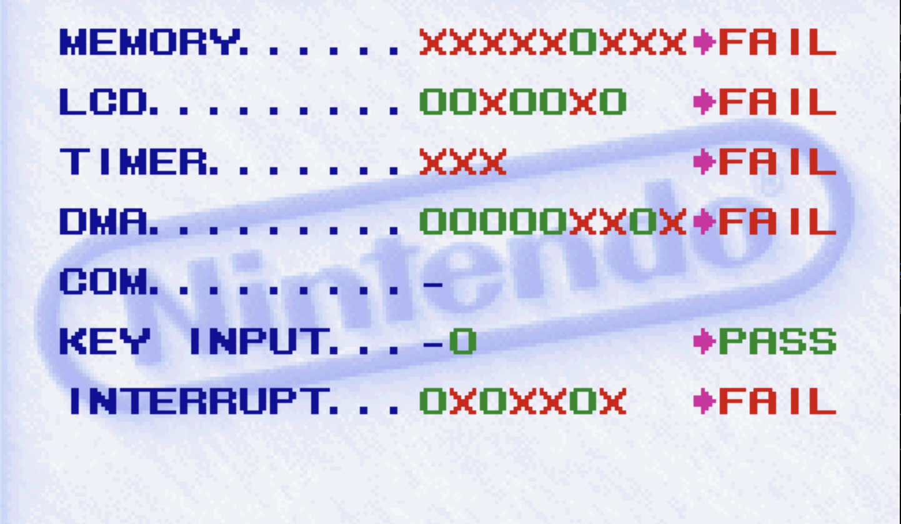
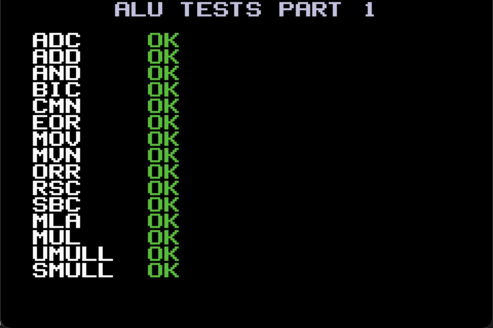
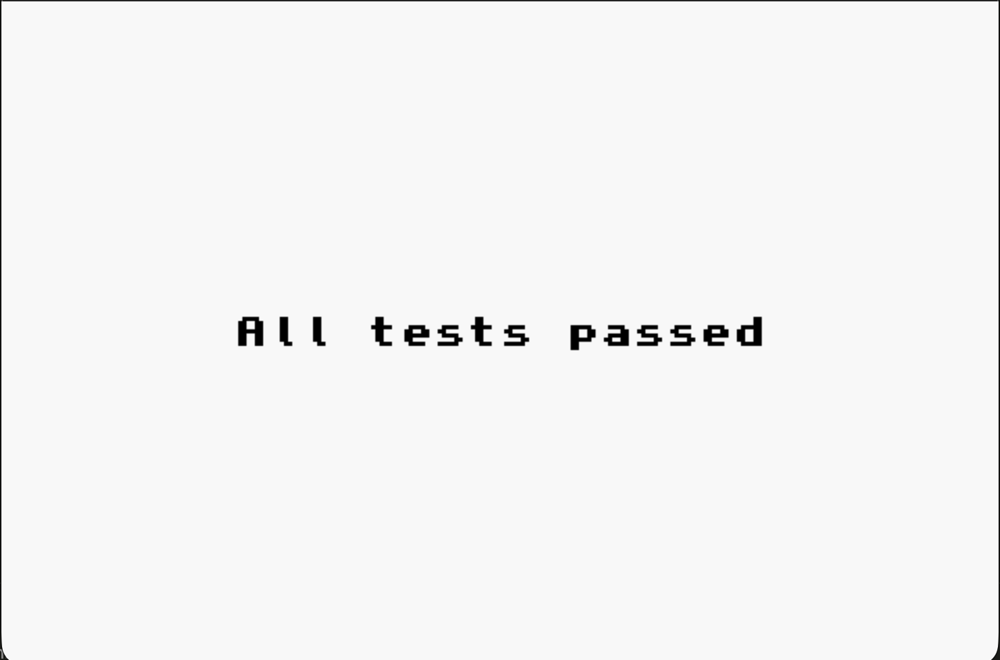

# EGBA

A cycle-accurate Game Boy Advance emulator written in Rust.

EGBA emulates the ARM7TDMI-based Nintendo GBA hardware with a focus on accuracy over speed — modeling per-cycle bus timing, pipeline flush semantics, and the hardware quirks that real software depends on. The emulator is structured as a modular Cargo workspace that cleanly separates the pure emulation core from all platform-specific I/O.

> **Status:** in active development. Boots the GBA BIOS, runs the AGS aging-test ROM end-to-end, renders all PPU background modes, plays DMA-driven audio, and persists EEPROM / Flash / SRAM saves. Compatibility with commercial titles varies — see [Test ROMs](#test-roms).

---

## Architecture

EGBA is organized as four crates with a strict dependency hierarchy:


| Crate | Role | Dependencies |
|-------|------|--------------|
| **egba-core** | CPU, memory bus, PPU, APU, DMA, timers, cartridge — entirely I/O-free | `bit`, `bitmatch` |
| **egba-ui** | SDL2 window rendering and audio queue | `sdl2` |
| **egba-debugger** | TUI stats overlay and ARM/THUMB instruction disassembler | `ratatui`, `crossterm`, `bitmatch` |
| **emulator** | CLI entry point — wires the core to the frontend | `clap` + all three crates |

`egba-core` has no dependency on SDL2, file I/O, or any platform API. The `GBA` struct exposes the framebuffer as `&[u32]` and audio as `&[(i16, i16)]` — the frontend is responsible for presenting them. This makes the core independently testable and portable to other frontends without modification. All hardware emulation is driven through a single `Bus` trait that the `Memory` struct implements, keeping the CPU and every peripheral behind a uniform byte-addressable interface.

---

### CPU — ARM7TDMI

Full ARMv4T instruction set (ARM + THUMB), decoded using the `bitmatch` procedural macro — each instruction's bit encoding is written inline as a pattern literal, keeping the decoders readable without sacrificing performance.

- 3-stage pipeline (`fetch → decode → execute`) with explicit `pipeline_dirty` flush on branches and mode switches
- Barrel shifter (LSL / LSR / ASR / ROR / RRX) with correct handling of shift-by-0, shift-by-32, and register-shift edge cases
- 7 operating modes (USR / SYS / SVC / IRQ / FIQ / ABT / UND) with banked registers and SPSR
- Exception entry sequence: Reset, SWI, Undefined, Prefetch/Data Abort, IRQ, FIQ
- Magnitude-dependent multiply cycle timing (1–4 internal cycles based on operand size)
- THUMB instructions delegate to ARM equivalents where possible, avoiding code duplication

### Memory bus

Full 32-bit address map with per-region wait-state accounting driving a single `bus_cycles` clock. Every memory access charges its correct cycle cost — ROM accesses track sequential vs. non-sequential timing, and WAITCNT writes immediately recalculate the wait-state tables.

Hardware quirks modeled: BIOS read protection (cached open-bus value when PC ≥ 0x4000), open-bus behavior on unmapped reads, EWRAM/IWRAM mirroring, OBJ VRAM byte-write suppression, BG VRAM and palette byte-write duplication to the halfword.

### PPU

Scanline-based renderer supporting all six background modes (text, affine, and bitmap) at 240 × 160. Uses a **two-layer priority compositor** — backgrounds and sprites are rasterized into `top` and `second` pixel buffers, which is necessary for correct alpha blending between layers.

- All 128 OAM sprite entries with affine transforms, mosaic, semi-transparency, and OBJ window
- WIN0 / WIN1 / OBJ window with per-window layer and effect enable masks
- Color special effects: alpha blend, brightness increase/decrease
- Affine BG reference points latched on VBlank, incremented per-scanline

### APU, DMA, timers, and interrupts

- **APU** — 2 DMA sound FIFOs (Direct Sound A / B), driven by timer overflow, stereo-mixed at 32,768 Hz
- **DMA** — 4-channel engine with Immediate / VBlank / HBlank / Special timing, bus-accurate cycle costs, and FIFO special mode for sound channels
- **Timers** — 4 cascading timers with prescaler (÷1 / ÷64 / ÷256 / ÷1024), driving APU sample output and IRQ generation
- **Interrupts** — IME / IE / IF with write-1-to-acknowledge; wakes HALT on `IE & IF ≠ 0` regardless of IME/CPSR.I

### Cartridge and saves

Backup type is auto-detected by scanning the ROM for ID strings (`EEPROM_V`, `SRAM_V`, `FLASH_V`, `FLASH512_V`, `FLASH1M_V`), or inferred from an existing `.sav` file's size. Supported: EEPROM (512 B / 8 KB), Flash (64 / 128 KB), SRAM (32 KB).

---

## Requirements

- Rust **1.75+** (Rust 2021 edition)
- **SDL2** development libraries on `PATH`
  - macOS: `brew install sdl2`
  - Debian / Ubuntu: `sudo apt install libsdl2-dev`
  - Arch: `sudo pacman -S sdl2`
- A real GBA BIOS (`bios.bin`, 16 KB) and a `.gba` ROM — **neither is distributed with this repo.**

## Build

```bash
git clone https://github.com/<you>/egba.git
cd egba
cargo build --release
```

## Run

```bash
cargo run --release -- \
    --bios path/to/bios.bin \
    --rom  path/to/game.gba \
    [--backup path/to/save.sav] \
    [--debug] \
    [--skip-bios]
```

| Flag | Description |
|------|-------------|
| `-b, --bios <PATH>` | Path to GBA BIOS (required) |
| `-r, --rom <PATH>` | Path to `.gba` ROM (required) |
| `-s, --backup <PATH>` | Save file path. Defaults to `<rom>.sav` next to the ROM |
| `-d, --debug` | Open ratatui TUI stats overlay (adds intentional 300 ms / frame sleep) |
| `--skip-bios` | Skip BIOS boot animation, jump straight to cart entry at `0x0800_0000` |
| `--headless --frames <N> [--screenshot <PATH>]` | Run N frames without opening a window, optionally dump framebuffer PPM, then exit |

### Default controls

| GBA button | Key |
|------------|-----|
| A / B | Z / X |
| L / R | A / S |
| Start / Select | Enter / Backspace |
| D-Pad | Arrow keys |
| Quit (+ save) | Esc or window close |

Backups are written to disk on every clean exit (Quit / Esc). Killing the process bypasses the save.

### Examples

Boot a ROM with the real BIOS:
```bash
cargo run --release -- -b roms/bios.bin -r roms/game.gba
```

Skip the BIOS intro:
```bash
cargo run --release -- -b roms/bios.bin -r roms/game.gba --skip-bios
```

Headless smoke render after 600 frames (~10 s of emulated time):
```bash
cargo run --release -- -b roms/bios.bin -r roms/ags_test.gba \
    --headless --frames 600 --screenshot docs/screenshots/run.ppm
```

Live in-terminal stats overlay:
```bash
cargo run --release -- -b roms/bios.bin -r roms/game.gba --debug
```

---

## Workspace layout

```
egba/
├── egba-core/           # Pure emulation core (no I/O dependencies)
│   └── src/
│       ├── gba.rs       # Public facade — run_frame(), framebuffer(), audio
│       ├── cpu/         # CPU struct, ALU, PSR, exceptions, ARM + THUMB decoders
│       ├── memory.rs    # Bus impl, full address map, wait-state accounting
│       ├── video/       # Scanline renderer, sprites, blending, windowing
│       ├── apu.rs       # DMA sound FIFOs and stereo mixing
│       ├── dma.rs       # 4-channel DMA engine
│       ├── timer.rs     # Cascading timers with prescaler
│       ├── control.rs   # Interrupt controller + system control
│       ├── cartridge/   # ROM bus, backup auto-detection (EEPROM, Flash, SRAM)
│       └── keypad.rs    # Button input + key-IRQ
├── egba-ui/             # SDL2 window (3× scale) + audio queue
├── egba-debugger/       # ratatui TUI + ARM/THUMB disassembler
├── emulator/            # clap CLI, 60 FPS loop, headless mode
└── assets/screenshots/
```

---

## Test ROMs

| Test ROM | Status | Notes |
|----------|--------|-------|
| GBA BIOS boot animation | ✅ Passes | Nintendo logo scrolls, palette fades, jumps to cart entry |
| `ags_test.gba` (Nintendo AGS aging) | 🟡 Partial | Boots and renders main menu. Passes KEY INPUT; fails MEMORY (1/9 pass), LCD (5/7 pass), TIMER (0/3 pass), DMA (6/9 pass), and INTERRUPT (3/7 pass) |
| `armwrestler.gba` | 🟡 Partial | Only passes ARM ALU and THUMB LDM/STM, LDR/STR instruction sets fully; fails other departments partially |
| jsmolka tests | 🟡 Partial | Only passes memory tests; fails thumb, nes, and bios |
| PeterLemon `GBA-Tests` | ⬜ Not yet run | CPU instruction and BIOS SWI low-level suite |
| mGBA tests | ⬜ Not yet run | Timer, DMA, and APU timing correctness suite |
| TONC demos (`first.gba`, `bm_modes.gba`, ...) | ⬜ Not yet run | Standard homebrew demos testing various PPU/interrupt layouts |

Legend: ✅ Pass · 🟡 Partial · ❌ Fails · ⬜ Not yet validated.

---

| GBA BIOS Boot | Nintendo AGS Aging | ARMwrestler |
|:---:|:---:|:---:|
|  |  |  |

| jsmolka `memory` | jsmolka `ppu/hello` | jsmolka `ppu/shades` | jsmolka `ppu/stripes` |
|:---:|:---:|:---:|:---:|
|  |  |  |  |