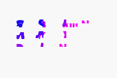
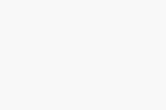

# EGBA

A cycle-accurate Game Boy Advance emulator written in Rust.

`egba` emulates the ARM7TDMI-based Nintendo GBA hardware as a modular Cargo workspace: a pure, I/O-free emulation core (`egba-core`), an SDL2 frontend (`egba-ui`), a ratatui-based TUI debugger (`egba-debugger`), and a thin CLI binary (`emulator`) that wires them together.

> Status: **in active development.** Boots the GBA BIOS, runs the AGS aging-test ROM end-to-end, renders all PPU background modes, plays 4-channel PSG + 2-channel DMA audio, and persists EEPROM / Flash / SRAM saves. Compatibility with commercial titles varies — see [Test ROM validation](#test-rom-validation).


---

## Features

### CPU — ARM7TDMI
- Full ARMv4T instruction set (ARM + THUMB), `bitmatch!`-driven decode
- 3-stage pipeline with `pipeline_dirty` flush semantics for branches / mode switches
- Barrel shifter (LSL / LSR / ASR / ROR / RRX) with correct shift-by-0, shift-by-32, and shift-by-`Rs==0` edge cases
- Operating modes: USR / SYS / SVC / IRQ / FIQ / ABT / UND with banked registers and SPSR
- Exception handling: Reset, SWI, Undefined, Prefetch / Data Abort, IRQ, FIQ
- Magnitude-dependent MUL / MLA cycle counts

### Memory bus
- Full 32-bit address map: BIOS, EWRAM, IWRAM, I/O, palette RAM, VRAM, OAM, cartridge ROM, cartridge SRAM
- Per-region wait-state accounting feeding the single `bus_cycles` clock
- Hardware quirks modelled: BIOS readable only while `PC < 0x4000` (cached open-bus value otherwise), open-bus reads return `last_bus_value`, EWRAM / IWRAM mirrored across their full 16 MB windows, OBJ VRAM byte-writes ignored, BG VRAM byte-writes duplicated to a halfword

### PPU
- All BG modes (0 – 5): tiled, affine, and bitmap
- Sprites with affine transforms, mosaic, semi-transparency, OBJ window
- BG / OBJ windowing and color-special-effects (alpha, brighten, darken)
- HBlank / VBlank IRQs and DMA triggers
- 240 × 160 ARGB framebuffer exposed as `&[u32]`

### APU
- 4 PSG channels (2 square + wave + noise) with envelope, sweep, length
- 2 DMA sound FIFOs driven by Timer 0 / Timer 1 overflow
- Stereo mixing into a 16-bit sample queue, drained by the SDL2 audio device

### System
- 4-channel DMA engine (Immediate / VBlank / HBlank / Special) with correct timing and IRQ raising
- 4 cascading timers with prescaler and overflow IRQ
- Keypad input with key-IRQ matching modes
- Cartridge backup auto-detection: EEPROM (512 B / 8 KB), Flash (64 / 128 KB), SRAM (32 KB)
- BIOS HLE optional via `--skip-bios`

### Tooling
- Drift-resistant 60 FPS event loop with per-second profiling line (events / run / render / audio / sleep ms, instructions, halt steps, cycles)
- Headless mode for screenshots and CI-style smoke runs
- Instruction tracer with PC breakpoints and word-watchpoints
- ratatui TUI stats overlay (`--debug`)

---

## Requirements

- Rust **1.75+** (Rust 2021 edition)
- **SDL2** development libraries on `PATH`
  - macOS: `brew install sdl2`
  - Debian / Ubuntu: `sudo apt install libsdl2-dev`
  - Arch: `sudo pacman -S sdl2`
- A real GBA BIOS (`bios.bin`, 16 KB) and a `.gba` ROM — **neither is distributed with this repo.**

## Build

```bash
git clone https://github.com/<you>/egba.git
cd egba
cargo build --release
```

A debug build is too slow to hit 60 FPS — always use `--release` for interactive runs.

## Run

```bash
cargo run --release -- \
    --bios path/to/bios.bin \
    --rom  path/to/game.gba \
    [--backup path/to/save.sav] \
    [--debug] \
    [--skip-bios]
```

| Flag | Description |
|------|-------------|
| `-b, --bios <PATH>` | Path to GBA BIOS (required) |
| `-r, --rom <PATH>` | Path to `.gba` ROM (required) |
| `-s, --backup <PATH>` | Save file path. Defaults to `<rom>.sav` next to the ROM |
| `-d, --debug` | Open ratatui TUI stats overlay (adds intentional 300 ms / frame sleep) |
| `--skip-bios` | Skip BIOS boot animation, jump straight to cart entry at `0x0800_0000` |
| `--headless --frames <N> [--screenshot <PATH>]` | Run N frames without opening a window, optionally dump framebuffer PPM, then exit |
| `--trace <N> [--trace-out <PATH>] [--break-pc <HEX>] [--watch <H1,H2,...>]` | Trace N instructions to a log (default `docs/captures/trace.log`), optionally stop on PC hit or log word-value changes at watched addresses |

### Default controls

| GBA button | Key |
|------------|-----|
| A / B | Z / X |
| L / R | A / S |
| Start / Select | Enter / Backspace |
| D-Pad | Arrow keys |
| Quit (+ save) | Esc or window close |

Backups are written to disk on every clean exit (Quit / Esc). Killing the process bypasses the save.

### Examples

Boot a ROM with the real BIOS:
```bash
cargo run --release -- -b roms/bios.bin -r roms/game.gba
```

Skip the BIOS intro:
```bash
cargo run --release -- -b roms/bios.bin -r roms/game.gba --skip-bios
```

Headless smoke render after 600 frames (~10 s of emulated time):
```bash
cargo run --release -- -b roms/bios.bin -r roms/ags_test.gba \
    --headless --frames 600 --screenshot docs/screenshots/run.ppm
```

Trace 100 000 instructions, stop when PC hits `0x080000C0`, watching IRQ-pending and a stack slot:
```bash
cargo run --release -- -b roms/bios.bin -r roms/game.gba \
    --trace 100000 --break-pc 080000C0 --watch 04000202,03007FFC
```

Live in-terminal stats overlay:
```bash
cargo run --release -- -b roms/bios.bin -r roms/game.gba --debug
```

---

## Workspace layout

```
egba/
├── egba-core/       # ARM7TDMI, memory bus, PPU, APU, DMA, timers, cartridge
│   └── src/
│       ├── cpu/     # cpu, alu, psr, exception, modes/{arm,thumb}
│       ├── video/   # background, sprite, render
│       ├── cartridge/backup/  # eeprom, flash, sram auto-detect
│       ├── apu.rs   bus.rs   dma.rs   memory.rs   timer.rs ...
│       └── gba.rs   # public GBA facade
├── egba-ui/         # SDL2 window + audio queue
├── egba-debugger/   # ratatui TUI + ARM/THUMB disassembler (EGBADebugger trait)
├── emulator/        # clap CLI + 60 FPS loop
└── assets/screenshots/   # README screenshots (tracked)
```

## Testing

```bash
cargo test --workspace
```

Tests are inline `#[cfg(test)]` modules. Three layers, per ADR 0003:

1. **Scenario tests** — one `#[test]` per behavior, table-driven inside. A failing row prints its label.
2. **Story tests** — script real hardware sequences (BIOS cold-boot, DMA copy, IRQ accept→return, full PPU frame) and assert state at each phase.
3. **`ags_test.gba` smoke** — headless screenshot diff, run manually after non-trivial changes.

No external test-ROM dependencies (no jsmolka / armwrestler / FuzzARM / TONC) — self-contained reproducibility is a goal.

---

## Test ROM validation

> **Incomplete.** Compatibility is tracked manually as fixes land. The list below reflects the current snapshot — it will grow (and occasionally shrink) as the core matures. Contributions welcome.

| Test ROM | Status | Notes |
|----------|--------|-------|
| GBA BIOS boot animation | ✅ Passes | Nintendo logo scrolls, palette fades, jumps to cart entry |
| `ags_test.gba` (Nintendo AGS aging) | 🟡 Partial | Boots and renders main menu; not all sub-tests validated yet |
| jsmolka `arm.gba` | ⬜ Not yet run | — |
| jsmolka `thumb.gba` | ⬜ Not yet run | — |
| jsmolka `memory.gba` | ⬜ Not yet run | — |
| jsmolka `nes.gba` | ⬜ Not yet run | — |
| `armwrestler-gba-fixed.gba` | ⬜ Not yet run | — |
| `FuzzARM` | ⬜ Not yet run | — |
| TONC demos (`first.gba`, `bm_modes.gba`, …) | ⬜ Not yet run | — |
| Commercial titles | ⬜ No regression matrix yet | — |

Legend: ✅ pass · 🟡 partial · ❌ fails · ⬜ not yet validated.

Per ADR 0003 the project deliberately avoids depending on external suites for CI gating, but they remain useful as out-of-band conformance checks. If you run any of the above against a build, open an issue or PR updating this table with the commit SHA and a screenshot under `assets/screenshots/`.

---

## Screenshots

| BIOS boot | Current build |
|-----------|---------------|
|  |  |

Framebuffer dumps from the headless runner live under `docs/screenshots/` (PPM, local-only).

---